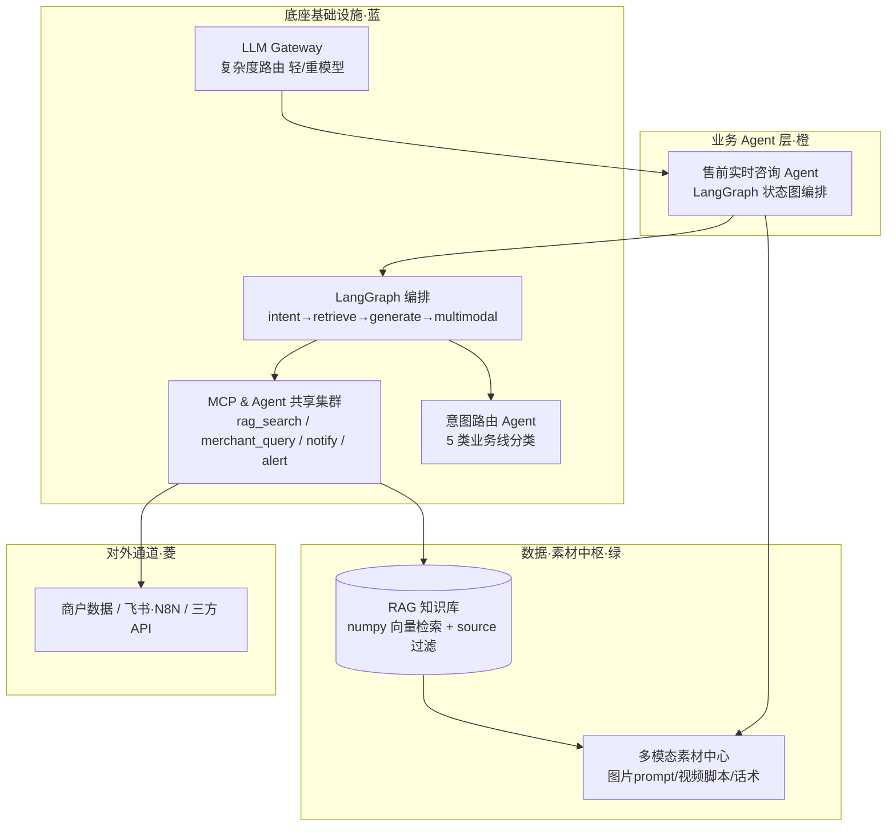

# 电商 Agent 运行时底座与 MCP 共享服务集群

> 跨境电商 AI 应用作品集 · 「[电商生态 AI 架构](#生态全景)」的**底座层**
> 双引擎运行时（自研 ReAct Loop + LangGraph）· MCP 工具集群 · LLM Gateway 成本路由 · Agent 公共链路
> 附带一个 **售前实时咨询 Agent** 作为底座的能力验证样例

---

## 这个仓库解决什么问题

上层每写一个业务 Agent，就要重写一遍「怎么编排、怎么调工具、怎么接模型、怎么处理失败」——这是重复劳动，也是每个 Agent 各自为战的根源。

本仓库把这些能力收敛成**一套底座**，让上层 Agent 只关心业务本身：

| 底座能力 | 实现 | 目录 |
| --- | --- | --- |
| **编排** | 自研 ReAct Loop（推理 → 工具 → 观察 → 反思）与 LangGraph 状态图各一版；节点可独立测试，编排过程不是黑盒 | `agents/loop_engine.py`、`agents/graph_agent.py` |
| **工具** | MCP 工具集群，工具注册为 `name -> {func, schema}`，语义对齐 MCP `tools/call`；多 Agent 共享同一套工具 | `mcp_server/server.py` |
| **模型接入** | LLM Gateway：四家厂商统一走 OpenAI 兼容协议，按任务复杂度路由轻 / 重模型；换厂商只改 `.env` | `core/llm_gateway.py` |
| **检索** | RAG as a Service：自研轻量向量库（numpy 余弦 + `source` 元数据过滤），知识库一次构建、多 Agent 共享 | `core/rag_service.py`、`core/embedder.py` |
| **记忆** | 多轮会话记忆（替代 Redis 会话态），按会话隔离 | `core/memory.py` |
| **路由** | 意图路由：把用户输入判定到 5 类业务线，再决定检索哪个域 | `agents/intent_router.py` |

**样例 Agent**：`apps/presale_agent/` 走完整链路——用户问商品 → 意图路由 → LangGraph 状态图编排 → 经 MCP 调 RAG / 商户工具 → LLM Gateway 路由模型 → 生成文字回答 + 可投放多模态素材（图片 prompt / 短视频脚本 / 直播话术）。它证明这套底座**能跑通一条真实业务链路**，而不是只有抽象接口。

---

## 架构位置



| 架构图层级 | 本仓库实现 |
| --- | --- |
| 业务 Agent（橙） | `apps/presale_agent/`（样例） |
| 数据·素材中枢（绿） | `core/rag_service.py` + `apps/presale_agent/multimodal.py` |
| **底座基础设施（蓝）· 本仓库主体** | `agents/` + `mcp_server/` + `core/llm_gateway.py` + `core/memory.py` |
| 对外通道（菱） | `mcp_server` 的 `merchant_query` / `notify` / `alert` |

静态版架构图见 [`架构图_规范化.svg`](架构图_规范化.svg)。

---

## 目录结构

```
ecom-agent-runtime/
├── config.py                 全局配置，读 .env，无 key 自动降级 MOCK
├── core/                     ← 底座：模型接入与检索基建
│   ├── llm_gateway.py        LLM Gateway：openai-compatible + 复杂度路由
│   ├── embedder.py           向量化（云端 embedding + 本地确定性降级）
│   ├── rag_service.py        自研轻量向量库（numpy 余弦 + source 过滤）
│   └── memory.py             多轮会话记忆（替代 Redis 会话态）
├── mcp_server/
│   └── server.py             MCP 工具集群（rag_search / merchant_query / notify / alert）
├── agents/                   ← 底座：编排与路由
│   ├── graph_agent.py        ★ LangGraph 状态图（主实现：意图→检索→生成→多模态）
│   ├── loop_engine.py        自研 ReAct Loop（原理对比，非主路径）
│   └── intent_router.py      意图路由（5 类业务线）
├── apps/presale_agent/       ← 样例业务 Agent（验证底座能力）
│   ├── agent.py              售前咨询入口（默认走 LangGraph）
│   └── multimodal.py         多模态素材生成（图片prompt/视频脚本/话术）
├── data/docs/                知识库样例（选品/评论/广告/物流/Listing）
├── scripts/
│   ├── ingest.py             文档入库（向量化）
│   └── demo.py               端到端演示
├── requirements.txt          numpy / python-dotenv / openai / langgraph / langchain-openai
├── .env.example              DeepSeek / 百炼 / OpenAI 三套配置
└── Dockerfile                python:3.13-slim，MOCK 可跑
```

---

## 快速开始（零成本，无需任何 key）

```bash
python -m venv .venv && .venv/Scripts/activate     # Windows
pip install -r requirements.txt
python scripts/ingest.py        # 文档入库（MOCK 向量）
python scripts/demo.py          # 端到端演示（LangGraph 编排 + 自动触发 RAG 工具）
```

无 `API_KEY` 时自动降级 MOCK：LangGraph 编排 / RAG 检索 / 意图路由 / MCP 工具调用 / 多模态链路**全部真实跑通**，仅推理文本为占位。可直接演示与讲解架构。

## 接入真实模型

```bash
cp .env.example .env
# 在 .env 填入任一家的 API_KEY（DeepSeek / 百炼 / OpenAI）
python scripts/ingest.py        # 用真实 embedding 重建知识库
python scripts/demo.py          # 真模型推理
```

| 供应商 | API_BASE | 聊天（轻/重） | embedding |
| --- | --- | --- | --- |
| DeepSeek | `https://api.deepseek.com/v1` | `deepseek-chat` / `deepseek-reasoner` | 无（保留 `MOCK_EMBED=true` 或换百炼） |
| 阿里云百炼 | `https://dashscope.aliyuncs.com/compatible-mode/v1` | `qwen-plus` / `qwen-max` | `text-embedding-v3` |
| OpenAI | `https://api.openai.com/v1` | `gpt-4o-mini` / `gpt-4o` | `text-embedding-3-small` |

> 关键点：模型供应商仅 `.env` 差异，业务代码零改动。

---

## 体现的能力点

- **双引擎运行时**：LangGraph 状态图把售前咨询拆成 `intent → retrieve → generate → multimodal` 节点，图可可视化、节点可独立测试；同时保留自研 ReAct Loop（`agents/loop_engine.py`）作为原理对照——LangGraph 底层同样是「推理→工具→观察→反思」，写得出这一版才说明不是只会调框架。
- **MCP 工具标准化**：工具注册为 `name -> {func,schema}`，Agent 经 `call_tool` 调用，语义对齐 MCP `tools/call`；多 Agent 共享一套工具，新增工具不改调用方。
- **RAG as a Service**：numpy 实现轻量向量检索 + `source` 元数据过滤隔离业务线，知识库一次构建被多 Agent 共享。
- **LLM Gateway 成本优化**：`classify_complexity` 按任务复杂度路由轻 / 重模型，简单任务不占大模型额度。
- **多模态内容生成**：咨询回答外自动产出图片 prompt / 短视频脚本 / 直播话术。
- **故障隔离**：`notify` / `alert` 走 `try/except`，通知失败不中断主链路。

---

## 生态全景

本仓库是「跨境电商 AI 生态」四层里的**底座层**，上游还有一个仓库承接数据层、业务层与交付层：

| 层 | 仓库 | 内容 |
| --- | --- | --- |
| **① 底座层** | **本仓库** `ecom-agent-runtime` | 双引擎运行时 · MCP 工具集群 · LLM Gateway · Agent 公共链路 |
| ② 数据层 | [`ecommerce-ai-workbench`](https://github.com/rchzc/ecommerce-ai-workbench) | RAG 知识库（26 篇 / 384 切片 · 混合重排）· AI 数据中台 · 平台数据连接器 |
| ③ 业务层 | 同上 | 7 个业务 Agent（选品 / Listing / 评论 / 广告 / 物流 / 客服 / 补货） |
| ④ 交付层 | 同上 | 单容器交付 · 128 个测试用例 · Webhook 对外集成 · 结构化日志 |

> ②③④ 共用同一个 FastAPI 后端与 `core/` 基础设施，因此放在同一仓库按层组织；本仓库（①）与它们**无代码依赖**，可独立 clone 运行。
